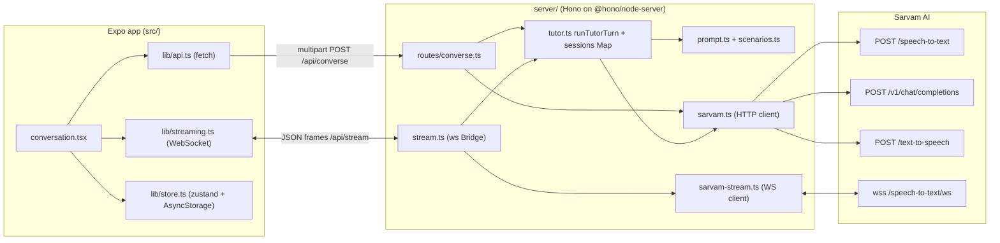

# Cognia

A voice English-practice app for students: an Expo / React Native client talks to a small Node proxy that chains Sarvam AI speech-to-text, chat completion and text-to-speech into one tutor turn.

## Overview

The student holds a mic button, speaks, and gets a spoken reply plus an on-screen transcript. The tutor's behaviour is set by a system prompt built from a locally stored profile (name, optional class, ability level, interests) and an optional guided lesson scenario.

The client never calls Sarvam directly. Sarvam authenticates with an API key header (including on the WebSocket upgrade request for streaming STT), so the key has to live on a server. `server/` is that proxy: it holds the key, owns the conversation history, and exposes one REST turn endpoint and one WebSocket endpoint.

There are two voice transports that share the same turn logic:

- **Turn-based (default):** record a file, upload it as multipart, server runs STT, LLM, TTS in sequence, returns JSON with base64 WAV.
- **Streaming (behind `EXPO_PUBLIC_STREAMING=1`):** the device streams 16 kHz mono PCM16 chunks over a WebSocket, the server relays them to Sarvam's streaming STT socket and pushes transcript segments back as live captions, then runs the same LLM + TTS step on commit. This path is written against Sarvam's documented protocol but has not been validated against a live key (see Status).

## Architecture



Both transports end in `runTutorTurn()` (`server/src/tutor.ts`): append the student text to the session history, build the system prompt, call the LLM, append the reply, call TTS, return text plus base64 WAV. LLM and TTS are plain request/response calls on both paths; only STT is streamed.

## Tech Stack

| Layer | Used in code |
| --- | --- |
| Client | Expo SDK 56, React Native 0.85, React 19, TypeScript, expo-router (stack navigation) |
| Client state | zustand with `persist` on AsyncStorage; @tanstack/react-query for the scenario query and the turn mutation |
| Client audio | expo-audio (file recording, playback), @siteed/audio-studio (PCM chunk capture for streaming), expo-file-system (writes reply WAV to cache) |
| i18n | i18next + react-i18next, locale from expo-localization; only an `en` resource block exists |
| Server | Node, TypeScript run through `tsx`, Hono + @hono/node-server, `ws` (both as WebSocket server and as client to Sarvam) |
| External | Sarvam AI: `saaras:v2.5` batch STT, `saaras:v3` streaming STT, `sarvam-m` chat, `bulbul:v2` TTS (all overridable by env) |

## Key Engineering Decisions

- **One turn function, two transports.** `routes/converse.ts` and `stream.ts` only differ in how they obtain `userText`; both call `runTutorTurn()` and share the `sessions` map in `tutor.ts`. The typed-text fallback in the app always uses the REST route, and still lands in the same history as streamed turns.
- **One upstream STT socket per utterance.** `Bridge` in `stream.ts` opens the Sarvam socket lazily on the first audio chunk, buffers chunks in `pending` until it is open, and closes it on commit. This avoids holding an idle upstream connection between turns, at the cost of a connection setup per utterance.
- **Commit is a flush plus a fixed wait.** On `commit` the bridge awaits any in-flight socket open, sends Sarvam a `flush`, then sleeps `FLUSH_GRACE_MS` (450 ms) before reading the accumulated transcript. There is no explicit "final segment" acknowledgement, so a late segment is dropped. A `committing` flag ignores duplicate commits.
- **Server owns lesson content.** `scenarios.ts` is the single source for the seven scenarios; `GET /api/scenarios` returns only card fields, while `goal`, `guidance` and the hidden `kickoff` instruction stay server-side and are injected into the prompt by `prompt.ts`.
- **Bounded context, not bounded storage.** `toMessages()` in `sarvam.ts` sends only the last `MAX_HISTORY_TURNS` history entries (default 12) and `chat()` caps output at `MAX_LLM_OUTPUT_TOKENS` (default 300). The stored history itself is never trimmed or evicted.
- **Upstream field names isolated.** All Sarvam request/response shapes live in `sarvam.ts` and `sarvam-stream.ts`; upstream errors are rethrown as `Sarvam STT|LLM|TTS <status>: <first 300 chars of body>`.

## API

### HTTP

| Method | Path | Request | Response |
| --- | --- | --- | --- |
| GET | `/api/health` | none | `{ ok, service, time }` |
| GET | `/api/scenarios` | none | `[{ id, emoji, title, blurb, levels }]` |
| POST | `/api/converse` | multipart: `sessionId`, `profile` (JSON string), and one of `audio` (file), `text`, or `opening=true`; optional `scenarioId` | `{ userText, replyText, audioBase64, mascotState }` |
| DELETE | `/api/converse/:sessionId` | none | `{ ok: true }` |

`POST /api/converse` errors are `{ error }` with status 400 (not multipart, missing `sessionId`, invalid `profile` JSON, neither audio nor text), 422 (empty transcript) or 502 (any failure in STT, LLM or TTS).

### WebSocket `/api/stream` (JSON text frames)

| Direction | `type` | Fields | Meaning |
| --- | --- | --- | --- |
| client to server | `init` | `sessionId`, `profile`, `scenarioId?`, `opening?` | Bind the socket to a session; with `opening` the tutor speaks first |
| client to server | `audio` | `data` (base64 PCM16, 16 kHz mono) | One mic chunk (client emits every 100 ms) |
| client to server | `commit` | none | Mic released; finalize STT and run the turn |
| client to server | `bye` | none | Tear down |
| server to client | `ready` | none | `init` accepted |
| server to client | `partial` | `text` | Accumulated transcript so far |
| server to client | `speechEnd` | none | Sarvam VAD end-of-speech (the app currently ignores it) |
| server to client | `final` | `text` | Committed student utterance |
| server to client | `reply` | `text` | Tutor reply text |
| server to client | `audio` | `data` (base64 WAV), `mime` | Tutor reply audio, sent as one frame |
| server to client | `state` | `state`: `listening`, `thinking`, `speaking`, `idle` | Drives the mascot |
| server to client | `error` | `message` | Followed by `state: idle` |

### State

There is no database. Server: `Map<sessionId, ChatTurn[]>` in process memory. Client: `profile`, `authed`, `onboarded`, `sessionId` and `progress` (streak, XP, completed scenario ids) persisted to AsyncStorage; transcript messages are in memory only. `Profile` and `ConverseResponse` are duplicated by hand in `server/src/types.ts` and `src/lib/types.ts`.

## Project Structure

```
src/
  app/            expo-router screens: index, signup, onboarding, home, lessons, conversation, settings
  components/     Mascot, MicButton, Transcript, themed-text, themed-view
  lib/
    api.ts        REST client for the proxy
    streaming.ts  WebSocket client + PCM capture hook
    audio.ts      file recorder and base64 WAV playback
    store.ts      zustand store (profile, session id, progress)
    config.ts     API_URL / WS_URL / STREAMING_ENABLED from env
    i18n.ts       UI strings
server/
  src/
    index.ts          Hono app, CORS, health + scenarios routes, attaches the WS server
    routes/converse.ts  turn-based endpoint
    stream.ts         per-connection Bridge for /api/stream
    sarvam.ts         HTTP client: STT, chat, TTS
    sarvam-stream.ts  WebSocket client for streaming STT
    tutor.ts          runTutorTurn and the in-memory session map
    prompt.ts         system prompt builder
    scenarios.ts      lesson catalogue
```

## Running Locally

Requires Node 20 or later (the server relies on global `fetch`, `FormData`, `Blob` and `File`) and a Sarvam AI API key. The app uses native audio modules, so it needs a development build rather than Expo Go.

Server:

```bash
cd server
npm install
cp .env.example .env        # set SARVAM_API_KEY
set -a; . ./.env; set +a    # the npm scripts do not load .env themselves
npm run dev                 # tsx watch src/index.ts, listens on PORT (default 3000)
```

| Variable | Default | Purpose |
| --- | --- | --- |
| `SARVAM_API_KEY` | none (required) | Sarvam key; without it turn and stream calls fail |
| `PORT` | `3000` | HTTP and WebSocket port |
| `SARVAM_STT_MODEL` / `SARVAM_TTS_MODEL` / `SARVAM_LLM_MODEL` | `saaras:v2.5` / `bulbul:v2` / `sarvam-m` | Model ids |
| `SARVAM_STT_STREAM_MODEL` | `saaras:v3` | Streaming STT model |
| `SARVAM_STT_AUDIO_ENCODING` | `audio/wav` | `audio.encoding` value sent with each streamed chunk |
| `SARVAM_TTS_SPEAKER` | `anushka` | TTS voice |
| `MAX_LLM_OUTPUT_TOKENS` / `MAX_HISTORY_TURNS` | `300` / `12` | Output cap and history window |

App (from the repository root):

```bash
npm install
cp .env.example .env        # EXPO_PUBLIC_API_URL, EXPO_PUBLIC_STREAMING
npm run android             # expo run:android   (or: npm run ios)
```

`EXPO_PUBLIC_API_URL` is only needed on a physical device (use the host's LAN address). Without it, `src/lib/config.ts` falls back to `http://10.0.2.2:3000` on Android and `http://localhost:3000` elsewhere. Set `EXPO_PUBLIC_STREAMING=1` to use the WebSocket path.

## Testing

No automated tests yet. Available checks are `npm run lint` (root, `expo lint`) and `npm run typecheck` (in `server/`, `tsc --noEmit`). There is no CI configuration.

## Status and Limitations

- **Streaming path unverified.** `sarvam-stream.ts` marks the per-chunk `encoding` value and the segment cadence as needing confirmation against a live key. Reply audio is one batch WAV on both paths; there is no streamed TTS and no barge-in (push-to-talk only).
- **No authentication on the server.** CORS is open to all origins, session ids are generated on the client, and any caller can post turns or delete a session. No rate limiting.
- **Sign-up is a placeholder.** `signup.tsx` collects email and password but every button only sets a local `authed` flag; nothing is sent anywhere.
- **History is in memory only.** It is lost on restart, never evicted, and tied to a single process. If the LLM call fails on an existing session, the student turn that was already appended stays in history without a reply.
- **Minimal input validation.** `profile` is parsed but not schema-checked; malformed profiles surface as 502. WebSocket frames that are not valid JSON are silently dropped.
- **No retries or timeouts** on Sarvam calls, and no reconnect logic on the client WebSocket.
- **Logging** is `console.log` / `console.error` only.
- **English only in practice.** Language codes for nine Indian languages are typed and passed through to Sarvam, but the UI ships only English strings, onboarding hardcodes `en-IN`, and the language row in Settings is a static "coming soon" chip.
- **Mascot is a placeholder** built from emoji and `Animated`; several installed dependencies (for example `lottie-react-native`) and Expo template assets are not referenced by the code.
- **No deployment artefacts:** no Dockerfile, no build step for the server (it runs through `tsx`).
- The root `LICENSE` is the unmodified Expo template MIT licence.
